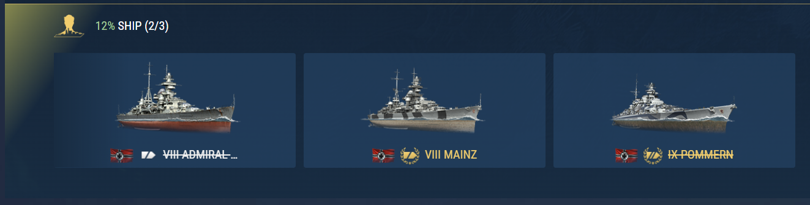

# myships
 MyShips chrome extention

## Download
Download and unpack zip file from the [GitHub](https://github.com/qMBQx8GH/myships/archive/refs/heads/main.zip)

## Install
1. Open extention management tab in chrome (chrome://extensions/)
2. Switch to developer mode.
3. Click "Load unpacked".
4. Browse to unpacked archive and choose myShips folder from src folder.

## Usage
Navigate to the page with container drop rates info:
- [NA](https://worldofwarships.com/en/content/contents-and-drop-rates-of-containers/)
- [EU](https://worldofwarships.eu/en/content/contents-and-drop-rates-of-containers/)
- [ASIA](https://worldofwarships.asia/en/content/contents-and-drop-rates-of-containers/)
- [CIS](https://worldofwarships.ru/ru/content/contents-and-drop-rates-of-containers/)

Wait until page loads. Now you may click on ships names to mark them as they are in your port.

Also you may open extention Options page

You will find there the list of all special and premium ships from the current version of the game sorted almost as they are sorted in the port by level, nation, class and name. Using the checkboxes you may mark the ships you've got.

Good luck and fair seas!
